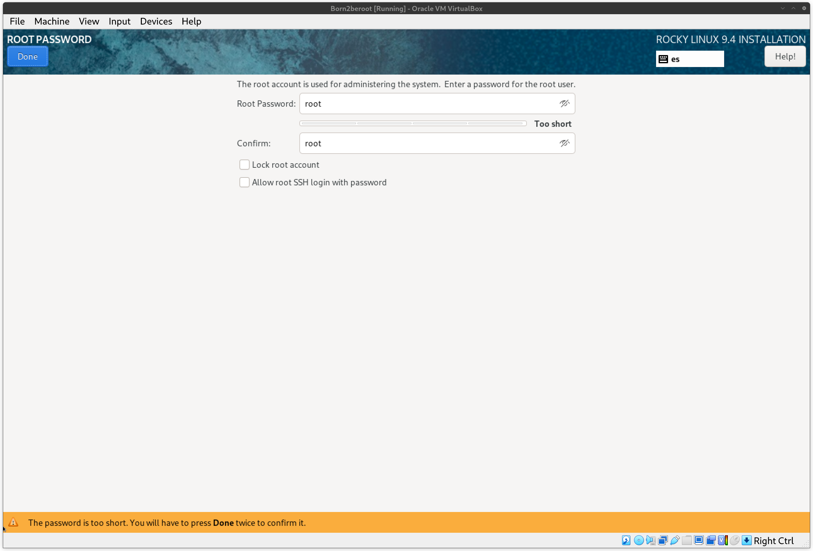
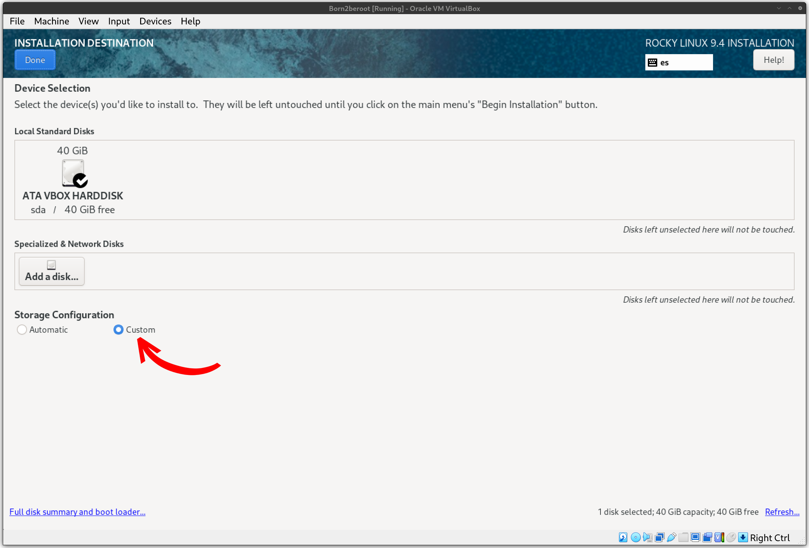
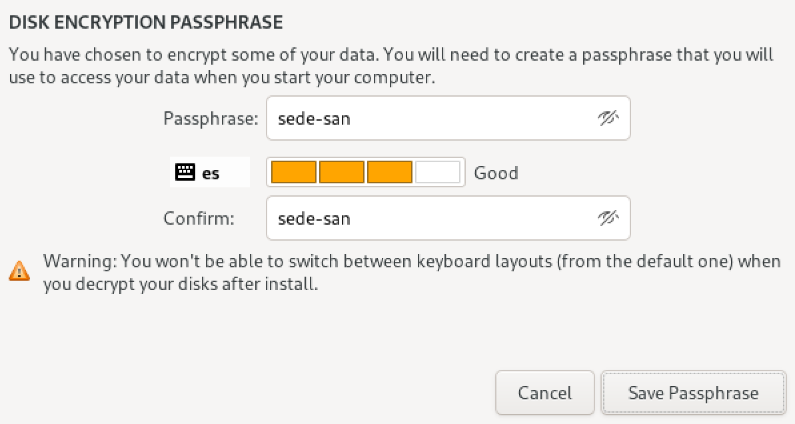
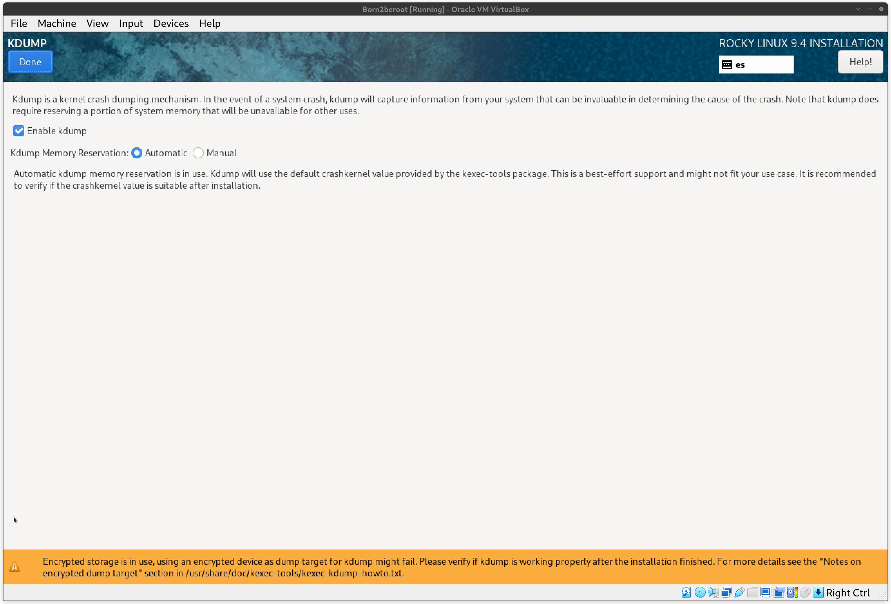
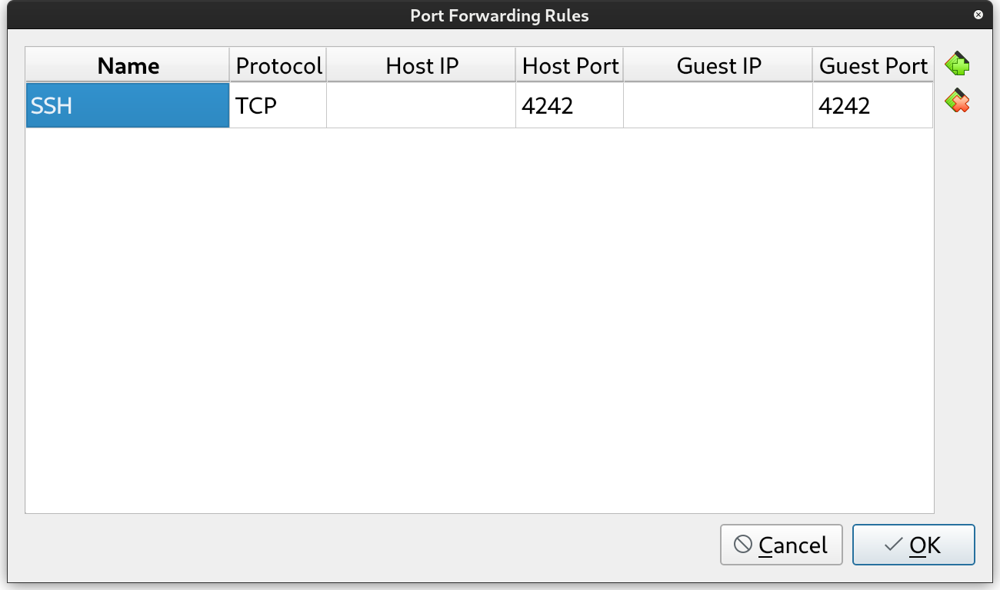
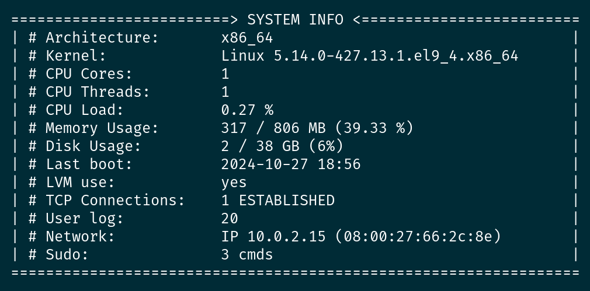

# Born2beroot

## 📋 Tabla de contenidos
- [Born2beroot](#born2beroot)
	- [📋 Tabla de contenidos](#-tabla-de-contenidos)
	- [👨🏻‍💻 Hipervisor](#-hipervisor)
	- [💿 Sistema operativo](#-sistema-operativo)
	- [💻 Configuración de la máquina virtual](#-configuración-de-la-máquina-virtual)
	- [📥 Instalación](#-instalación)
	- [💯 Parte obligatoria](#-parte-obligatoria)
		- [Gestor de paquetes](#gestor-de-paquetes)
		- [SELinux (Security-Enhanced Linux)](#selinux-security-enhanced-linux)
			- [Configuración](#configuración)
		- [LVM (Logical Volume Manager)](#lvm-logical-volume-manager)
		- [SSH (Secure Shell)](#ssh-secure-shell)
			- [Configuración](#configuración-1)
		- [Firewalld](#firewalld)
			- [Defensa](#defensa)
		- [Hostname](#hostname)
			- [Configuración](#configuración-2)
		- [Política de contraseñas](#política-de-contraseñas)
			- [Configuración](#configuración-3)
		- [Sudo](#sudo)
			- [Configuración](#configuración-4)
			- [Defensa](#defensa-1)
		- [Script](#script)
			- [Creación del script](#creación-del-script)
		- [Crontab](#crontab)
			- [Configuración](#configuración-5)
	- [🏁 Entrega del proyecto](#-entrega-del-proyecto)
	- [🅱️ Parte bonus](#️-parte-bonus)

## 👨🏻‍💻 Hipervisor
[Oracle VM Virtualbox](https://www.virtualbox.org/)

## 💿 Sistema operativo
Se ha decidido realizar este proyecto con [Rocky Linux v9.4](https://rockylinux.org/) utilizando la `minimal.iso` como imagen del sistema operativo.

## 💻 Configuración de la máquina virtual
Se recomienda configurar 2GB (2048 MB) de RAM y 2 CPUs como mínimo.

El disco se reserva de manera dinámica. De esta manera, aunque indiquemos que nuestro disco tendrá 40 GB de almacenamiento, solo ocupará el espacio que vaya usando, hasta 40 GB.

## 📥 Instalación
La configuración de usuarios la haremos de la siguiente manera:
-	Habilitaremos el usuario root (la contraseña la cambiaremos a lo largo de la actividad).

-	Crearemos otro usuario usando nuestro login como nombre (la contraseña la cambiaremos a lo largo de la actividad). Además, deberemos incluir a este usuario en los grupos *sudo* (grupo de administradores) y *user42*. Para añadirlo a este último en la instalación del sistema operativo, deberemos pinchar en el botón de *Advanced...*

Al hacer esto, se nos abrirá una nueva pestaña de configuración avanzada. Ahí indicaremos los grupos en los que queremos que nuestro nuevo usuario esté. En sistemas Linux, cada grupo lleva asignado un código único (GID) que deberemos especificar entre paréntesis, en nuestro caso indicaremos el 4242, puesto que los 1000 primeros (0-999) suelen estar reservados. El grupo *wheel* hace referencia al grupo de administradores por defecto, nos encargaremos de eso más tarde.

> [!NOTE]
> No se recomienda asignar GIDs por encima del 60000.

La práctica nos indica que debemos crear 2 particiones (o 5 si hacemos las partes bonus, como será en el caso de esta guía) cifradas usando LVM. Para ello, accederemos a la configuración de almacenamiento y realizaremos los siguientes pasos:
-	Seleccionamos el disco en el que queramos instalar el sistema operativo, en nuestro caso  el que hemos instalado. Para poder acceder al cifrado y particionado, deberemos configurar el almacenamiento como *Personalizado* o *Custom*.

Al presionar el botón de *Done*, nos pasará a la configuración de las particiones. En nuestro caso, la realizaremos de la siguiente manera:

Al haber seleccionado la casilla de *Encrypt* para encriptar el disco:

Kdump requiere de configuración adicional al cifrar el disco (este paso es necesario para poder hacer la instalación, el subject no pide configurar esta herramienta):
-	Para ello, habilitaremos la reserva de memoria automática:

Una vez haya quedado todo configurado, presionaremos el botón de *Begin installation* para instalar el sistema operativo con toda la configuración seleccionada.

## 💯 Parte obligatoria

### Gestor de paquetes
Rocky Linux utiliza dnf como gestor de paquetes.

### SELinux (Security-Enhanced Linux)
SELinux es un sistema de control de acceso obligatorio integrado en el núcleo de Linux. Este añade una capa adicional de control que define qué operaciones pueden realizar cada usuario, proceso o aplicación en el sistema, independientemente de los permisos tradicionales. Para ello, utiliza políticas predefinidas o personalizadas que describen cómo deben comportarse las aplicaciones y los usuarios, definiendo qué procesos pueden acceder a qué recursos del sistema, esto lo realiza aplicando una etiqueta, o contexto, de seguridad que es evaluada antes de permitir el acceso.

Puede funcionar en tres distintos modos:
-	Enforcing (Aplicación). Aplica estrictamente las políticas de seguridad, bloqueando cualquier acceso no permitido.
-	Permissive (Permisivo). Registra pero no bloquea las violaciones de las políticas.
-	Disabled (Deshabilitado). Como bien indica el nombre, SELinux no realiza ninguna acción de seguridad en este modo.

En resumen, SELinux otorga una mayor seguridad frente a las amenazas con respecto a las ACL comunes, pues cada proceso y usuario, aún con permisos, puede o no realizar cambios dependiendo de las etiquetas que tenga definidas, limitando los daños que un ataque pueda provocar al sistema.

#### Configuración
Para configurar SELinux, deberemos acceder al archivo `/etc/sysconfig/selinux`. Una vez dentro, nos aseguraremos de que los siguientes parámetros aparecen como se muestra a continuación:
-	SELINUX=enforcing
-	SELINUXTYPE=targeted

> [!NOTE]
> Se recomienda configurar el modo de funcionamiento en *permissive* durante la configuración inicial, ya que el sistema puede tener recursos mal iniciados que no permitan el proceso de arranque.

Para confirmar los cambios, será necesario guardar el archivo y reiniciar el sistema. Una vez este arranque de nuevo, ya tendremos nuestra política de seguridad activa.

> [!TIP]
> Puedes consultar la política que se está ejecutando en todo momento con el comando `getenforce`.

Fuente: [https://www.redhat.com/es/topics/linux/what-is-selinux]()

### LVM (Logical Volume Manager)
El almacenamiento tradicional se basa en el espacio individual de cada disco. LVM, sin embargo, administra el espacio combinando la capacidad de los discos disponibles. De esta manera, LVM considera el almacenamiento de todos los discos como una capacidad total. Esto se consigue designando los discos de almacenamieno como *Volúmenes Físicos (PV)*, o capacidad que puede usar LVM. A continuación, estos PVs son añadidos a uno o más *Grupos de Volúmenes (VG)*. Por último, estos VGs son añadidos a uno o más *Volúmenes Lógicos (LV)*, los cuales son tratados como particiones tradicionales.

Fuente: [https://www.redhat.com/sysadmin/lvm-vs-partitioning]()

### SSH (Secure Shell)
SSH es un protocolo que permite conectar dos máquinas mediante un canal cifrado.

Este servicio ya viene instalado por defecto en el sistema, para verificar que está activo deberemos ejecutar el comando `systemctl status sshd`.

#### Configuración
El subject requiere que el servicio se ejecute en el puerto 4242 y que no sea posible conectarse como root. Para hacer estos cambios, deberemos acceder al fichero de configuración `/etc/ssh/sshd_config` y realizar los siguientes cambios:
-	`/etc/ssh/sshd_config`:21 => Port 4242
-	`/etc/ssh/sshd_config`:40 => PermitRootLogin no

Una vez hecho el cambio y guardado el archivo, nos dirigiremos al fichero `/etc/ssh/ssh_config` y modificaremos la siguiente línea:
-	`/etc/ssh/ssh_config`:38 => Port 4242

Aunque estos dos ficheros se encargan de la configuración del servicio, debemos indicarle a SELinux este cambio. Para ello, ejecutaremos el comando `semanage port -a -t ssh_port_t -p tcp puerto`, siendo puerto el que acabamos de poner.

Si al ejecutar el comando obtenemos el siguiente mensaje de error

	-bash: semanage: command not found

Buscaremos las dependencias del paquete `semanage` con el comando `yum provides /usr/sbin/semanage`.

Sabiendo esto, instalaremos dichas dependencias con el comando `yum install policycoreutils-python-utils`. Una vez instaladas las dependencias, no debería haber problemas al correr el comando de nuevo.

Una vez le hayamos indicado a SELinux el nuevo puerto sobre el que correrá nuestro servicio, deberemos abrir el puerto con el comando `firewall-cmd --zone=public --add-port=puerto/tcp --permanent`. Tras hacerlo, reiniciaremos el firewall y el servicio con los comandos `firewall-cmd --reload` y `systemctl restart sshd`. Al estar corriendo nuestro servidor en un entorno "aislado" a nivel de red, deberemos acudir a la configuración de VirtualBox para poder conectar nuestro equipo con la máquina virtual de la siguiente manera:

> [!WARNING]
> Comprueba que el puerto 4242 funcione, en 42 Madrid hemos llegado a la conclusión de que el puerto no funciona correctamente. Si es tu caso, prueba a cambiarlo a otro (ej. 4141).

Fuente: [https://jumpcloud.com/blog/how-to-configure-secure-ssh-server-rocky-linux]()

### Firewalld
Los firewalls, o cortafuegos en español, son aplicaciones que actúan a nivel de red abriendo o cerrando puertos para permitir el funcionamiento de otras aplicaciones. Podríamos decir que es como un "antivirus de red". Lo que hemos hecho en el apartado anterior ha sido decirle a nuestro firewall que, abriera el puerto que le hemos indicado para que el protocolo *ssh* pueda procesar todo lo que llega por ahí.

Para verificar qué puertos tenemos abiertos, ejecutaremos el comando `firewall-cmd --list-all`, lo que nos dará una salida similar a esta:

#### Defensa
Durante la defensa, se nos pedirá abrir y cerrar el puerto 8080. Para ello, deberemos realizar los siguientes pasos:
-	Abrimos el puerto con el comando `firewall-cmd --zone=public --add-port=8080/tcp --permanent`
-	Reiniciamos el firewall para habilitar dicho cambio con los comandos `firewall-cmd --reload` y `systemctl restart sshd`
-	Listamos todos los puertos abiertos con el comando `firewall-cmd --list-all`
-	Cerramos el puerto con el comando `firewall-cmd --remove-port=8080/tcp`
-	Confirmamos el cambio con el comando `firewall-cmd --runtime-to-permanent`
-	Listamos de nuevo los puertos para confirmar que se cerró con el comando `firewall-cmd --list-all`

Fuente: [https://docs.fedoraproject.org/en-US/quick-docs/firewalld/]()

### Hostname
El hostname es el nombre por el que se conoce un equipo dentro de una red. Esto se utiliza con el fin de identificar más fácilmente un equipo dentro de una red.

#### Configuración
Tenemos dos maneras de poder cambiar el nombre del equipo:
-	Modificando el fichero `/etc/hostname`
-	Usando el comando `hostnamectl set-hostname nombre` *(en el caso de Born2beroot, el hostname deberá ser el login del estudiante seguido de 42 (ej.: sede-san42))*

Si queremos modificar el hostname "bonito", deberemos ejeutar el comando `hostnamectl set-hostname --pretty nombre` (si el nombre es el mismo que el hostname, esto no tendrá efecto alguno).

Será necesario reiniciar el equipo para poder ver los cambios. Podemos hacer esto con el comando `reboot`.

Fuente: [https://www.geeksforgeeks.org/hostnamectl-command-in-linux-with-examples/]()

### Política de contraseñas
Una política de contraseñas es un conjunto de reglas que se aplican a la hora de crear o cambiar contraseñas con el objetivo de evitar la creación de contraseñas fáciles de descifrar por un tercero. Si bien, una contraseña con una política fuerte la hace muy poco probable a ser descifrada, hay que encontrar un balance entre seguridad y comodidad pues, muchos usuarios se podrían ver abrumados por tantas reglas.

#### Configuración
-	Tu contraseña debe expirar cada 30 días.
	-	`/etc/login.defs`:131 => PASS_MAX_DAYS 30 *(este ajuste solo aplica para los nuevos usuarios)*
	-	Para usuarios ya existentes, se deberá utilizar el comando `chage -M 30 usuario`
-	El número mínimo de días permitido antes de modificar una contraseña deberá ser 2.
	-	`/etc/login.defs`:132 => PASS_MIN_DAYS 2 *(este ajuste solo aplica para los nuevos usuarios)*
	-	Para usuarios ya existentes, se deberá utilizar el comando `chage -m 2 usuario`
-	El usuario debe recibir un mensaje de aviso 7 días antes de que su contraseña expire.
	-	`/etc/login.defs`:133 => PASS_WARN_AGE 7 *(este ajuste solo aplica para los nuevos usuarios)*
	-	Para usuarios ya existentes, se deberá utilizar el comando `chage -W 7 usuario`
-	Tu contraseña debe tener como mínimo 10 caracteres de longitud. Debe contener una mayúscula, una minúscula y un número. Por cierto, no puede tener más de 3 veces consecutivas el mismo carácter.
	-	`/etc/security/pwquality.conf`:11 => minlen = 10
	-	`/etc/security/pwquality.conf`:20 => ucredit = -1
	-	`/etc/security/pwquality.conf`:25 => lcredit = -1
	-	`/etc/security/pwquality.conf`:15 => dcredit = -1
	-	`/etc/security/pwquality.conf`:38 => maxrepeat = 3
-	La contraseña no puede contener el nombre del usuario.
	-	`/etc/security/pwquality.conf`:55 => usercheck = 1
-	La contraseña debe tener al menos 7 caracteres que no sean parte de la antigua contraseña. *Esta regla no se aplica para root*.
	-	`etc/security/pwquality.conf`:6 => difok = 7
-	Evidentemente, tu contraseña para root debe seguir esta política.
	-	`etc/security/pwquality.conf`:74 => enforce_for_root

En resumen, el archivo `pwquality.conf` contiene una gran cantidad de opciones para fortalecer las contraseñas de los usuarios de nuestro servidor. Born2beroot nos permite habilitar las reglas más utilizadas a la hora de reforzar la seguridad en las contraseñas.

Una vez cambiada la política de contraseñas, deberemos actualizar las contraseñas de todos los usuarios ya existentes con el comando `passwd usuario`. Si la configuración se ha aplicado correctamente, un intento de contraseña que no cumpla todas las nuevas reglas devolverá un error en la terminal.

Podremos consultar la caducidad de las contraseñas de un usuario concreto con el comando `chage -l usuario`.

Fuente: [https://www.server-world.info/en/note?os=Rocky_Linux_8&p=pam&f=1]()

### Sudo
Sudo es un programa esencial a día de hoy en los sistemas Linux, y que poco a poco se va integrando a otros sistemas operativos como Windows, el cual permite ejecutar comandos como administrador sin tener que ser el usuario root específicamente.

#### Configuración

> [!WARNING]
> El grupo sudo no existe por defecto en Rocky Linux, se conoce como *wheel*. Para cambiar el nombre del grupo, deberemos ejecutar el comando `groupmod wheel -n sudo`. Deberemos reflejar este mismo cambio en todos los ficheros que hagan uso del grupo *wheel* (ej. `/etc/sudoers`).

Toda la configuración referente al comando `sudo` se encuentra disponible en el fichero `/etc/sudoers`.

> [!WARNING]
> Aunque se nos recuerda en la cabecera del propio fichero, este deberá ser editado utilizando `visudo`. Este evita que varias personas editen el archivo de manera simultánea y verifica la sintaxis antes de guardar los cambios. Los cambios se realizan sobre un fichero temporal `/etc/sudoers.tmp` y, una vez se guarda, los cambios se aplican sobre el fichero real.

-	Autenticarte con sudo debe estar limitado a tres intentos en el caso de introducir una contraseña incorrecta.
	-	`/etc/sudoers` => Defaults passwd_tries=3
-	Un mensaje personalizado de tu elección debe mostrarse en caso de que la contraseña introducida sea incorrecta cuando se utilice sudo.
	-	`/etc/sudoers` => Defaults badpass_message="mensaje"
	-	Si queremos que, en vez de mostrar un mensaje personalizado, la máquina nos insulte, deberemos habilitar el siguiente ajuste (habilitando esta configuración, se ignora badpass_message): `/etc/sudoers` => Defaults insults
-	Para cada comando ejecutado con sudo, tanto el input como el output deben quedar archivados en el directorio /var/log/sudo/.
	-	`/etc/sudoers` => Defaults logfile="/var/log/sudo/sudo.log"
	-	`/etc/sudoers` => Defaults iolog_dir="/var/log/sudo/iolog"
	-	`/etc/sudoers` => Defaults log_input, log_output
> [!NOTE]
> Si el directorio no existe, deberemos crearlo nosotros a mano (`mkdir -p /var/log/sudo/iolog`).
-	El modo TTY debe estar activado por razones de seguridad.
	-	`/etc/sudoers` => Defaults requiretty
-	Por seguridad, los directorios utilizables por sudo deben estar restringidos. Por ejemplo: /usr/local/sbin:/usr/local/bin:/usr/sbin:/usr/bin:/sbin:/bin:/snap/bin
	-	`/etc/sudoers`:88 => Defaults secure_path = /usr/local/sbin:/usr/local/bin:/usr/sbin:/usr/bin:/sbin:/bin:/snap/bin

#### Defensa
Durante la defensa, se nos pedirá otorgar permisos de sudo a un nuevo usuario. Para ello, deberemos acceder nuevamente al archivo `/etc/sudoers` y añadir lo siguiente:

	usuario	ALL=(ALL)	ALL

Introduciendo esta línea estamos dando permiso al usuario para que en cualquier equipo pueda ejecutar cualquier comando.

En caso de tener un grupo de administradores (*sudo* en muchos sistemas Linux por defecto, o *wheel* en caso de Rocky), podemos añadir al usuario al grupo y ya tendría dichos permisos. Esto solo aplica si existe la siguiente regla:

	%grupo	ALL=(ALL)	ALL

> [!NOTE]
> En este caso, deberemos reiniciar la máquina una vez llevado a cabo este cambio.

Esto, al contrario que en el caso anterior, aplica los permisos de *sudo* sobre el grupo, y no sobre un usuario concreto.

Fuente: [https://www.geeksforgeeks.org/useful-sudoers-configurations-for-setting-sudo-in-linux/]()

### Script

#### Creación del script
El subject requiere que realicemos un script que, cada 10 minutos, muestre la siguiente información:
-	La arquitectura de tu sistema operativo y su versión de kernel.
-	El número de núcleos físicos.
-	El número de núcleos virtuales.
-	La memoria RAM disponible actualmente en tu servidor y su porcentaje de uso.
-	La memoria disponible actualmente en tu servidor y su utilización como un porcentaje.
-	El porcentaje actual de uso de tus núcleos.
-	La fecha y hora del último reinicio.
-	Si LVM está activo o no.
-	El número de conexiones activas.
-	El número de usuarios del servidor.
-	La dirección IPv4 de tu servidor y su MAC (Media Access Control)
-	El número de comandos ejecutados con sudo.

Para ello, crearemos el archivo `/root/monitoring.sh` y pondremos lo siguiente:

	#! /bin/bash
	
	#                                                     #  ####
	#       login:  sede-san                       		# #     #
	#       email:  sede-san@student.42madrid.com      ####  #
	#                                                     #  ####
	
	# OS info
	architecture=$(uname -p)
	kernel=$(uname -sr)
	
	# CPU info
	cpuCores=$(lscpu | awk 'FNR==12 {print $4}')
	cpuThreads=$(lscpu | awk 'FNR==11 {print $4}')
	cpuLoad=$(awk '/cpu/' /proc/stat | awk 'NR==1 {printf "%.2f", 100-(($5*100)/($2+$3+$4+$5+$6+$7+$8+$9))}')
	
	# RAM info
	ramTotal=$(free --mega | awk '/Mem/ {print $2}')
	ramUsed=$(free --mega | awk '/Mem/ {print $3}')
	ramPercentage=$(awk "BEGIN {printf \"%.2f\", ${ramUsed}/${ramTotal}*100}")
	
	# Disk info
	diskTotal=$(df --block-size=1GB --total | awk '/total/ {print $2}')
	diskUsed=$(df --block-size=1GB --total | awk '/total/ {print $3}')
	diskPercentage=$(df --block-size=1GB --total | awk '/total/ {print $5}')
	
	# Last boot
	lastBoot=$(who -b | awk '{print $3, $4}')
	
	# LVM used
	lvmUsed=$(if [ $(lsblk | awk '/lvm/' | wc -l) -gt 0 ]; then echo "yes"; else echo "no"; fi)
	
	# TCP/IP connections
	tcp=$(/usr/sbin/ss | awk '/tcp/ {print $4}' | wc -l)
	
	# User count
	userCount=$(cat /etc/passwd | wc -l)
	
	# Network info
	ipv4=$(/usr/sbin/ip a | awk '/inet/' | awk NR==3 | awk '{print $2}' | awk -F'/' '{print $1}')
	macAddress=$(/usr/sbin/ip a | awk '/link\/ether/ {print $2}')
	
	# Sudo commmands
	sudoCount=$(awk '/COMMAND/' /var/log/sudo/sudo.log | wc -l)
	
	wall -n "       =========================> SYSTEM INFO <=========================
	        | # Architecture:       ${architecture}                                 |
	        | # Kernel:             ${kernel}       |
	        | # CPU Cores:          ${cpuCores}                                     |
	        | # CPU Threads:        ${cpuThreads}                                   |
	        | # CPU load:           ${cpuLoad} %                                    |
	        | # Memory Usage:       ${ramUsed} / ${ramTotal} MB (${ramPercentage} %)                        |
	        | # Disk Usage:         ${diskUsed} / ${diskTotal} GB (${diskPercentage})                               |
	        | # Last boot:          ${lastBoot}                     |
	        | # LVM use:            ${lvmUsed}                                      |
	        | # TCP Connections:    ${tcp} ESTABLISHED                              |
	        | # User log:           ${userCount}                                    |
	        | # Network:            IP ${ipv4} (${ipv6})    |
	        | # Sudo:               ${sudoCount} cmds                                       |
	        ================================================================="

Si lo hemos hecho bien, deberíamos ver algo similar a esto al ejecutar el script:

### Crontab
Crontab es un programa que actúa en segundo plano que permite ejecutar programas en un cierto intervalo de tiempo.

El subject requiere que ejecutemos el script que acabamos de crear cada 10 minutos.

#### Configuración
Para configurar el crontab, ejecutaremos el comando `crontab -e`, editando así el cron del usuario actual. Si quisiéramos editar el cron de algún otro usuario, deberemos ejecutar el comando `crontab -u usuario -e`.

Una vez dentro, deberemos incluir la siguiente línea en el fichero:
	*/10	*	*	*	*	bash ruta-al-script

> [!NOTE]
> Puedes consultar la configuración del crontab con el comando `crontab -l`, o `crontab -u usuario -l` si quisiéramos consultar la de otro usuario.

## 🏁 Entrega del proyecto
Una vez hayas finalizado todo, asegúrate de apagar la máquina virtual correctamente. Tras esto, abre un terminal y accede a la ruta donde tengas guardada la máquina virtual. Ahí, ejecutaremos el comando `sha1sum disco-virtual.vdi`. El comando nos devolverá un código alfanumérico y el nombre del archivo, nos copiaremos el código y lo pegaremos en el repositorio de entrega bajo el archivo `signature.txt` y realizaremos la entrega.

Para evitar que el código cambie, deberemos hacer todas las evaluaciones sobre una copia de la máquina. Para ello, accederemos a  la pestaña principal de VirtualBox y 

## 🅱️ Parte bonus
*No hecha*